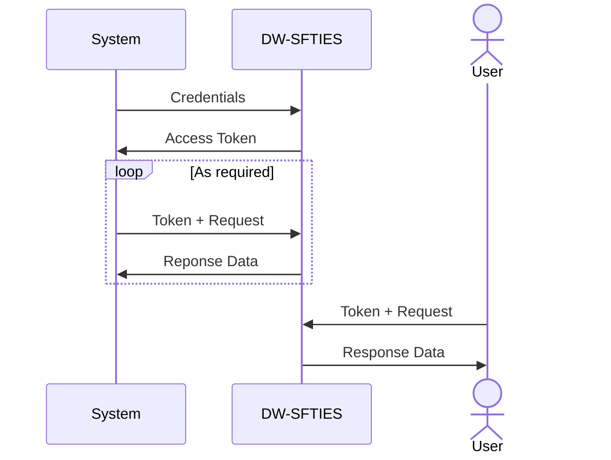

<!-- Moved this note up to the top and formatted it to highlight it -->
> [!NOTE]
>  This is just a quick proof-of-concept and best practices for software development has not been followed

# Connect To DW-SFTIES
Simple python programs to connect to DW-SFTIES api's using two different models
1. Machine to machine (Limited access right now, need to get credentials from EPA)
2. Using API tokens from the UAT environment (login into your cdx account --> DW-SFTIES UAT ---> Profile ---> Copy access token)

<!-- Added this diagram. Hopefully it helps show how a user vs a machine/system would query the APIs -->

# What does the script return?
The script returns a list of water systems in your primacy agency. However, you can modify the script to return any information associated with the Drinking Water program available in DW-SFTIES database.

# Where can I find the api endpoints?
Our swagger pages: https://dwsfties-uat.epa.gov/swagger

# What else...?
You can play around to filter the data or extract only the relevant information to programmatically interact with the api
