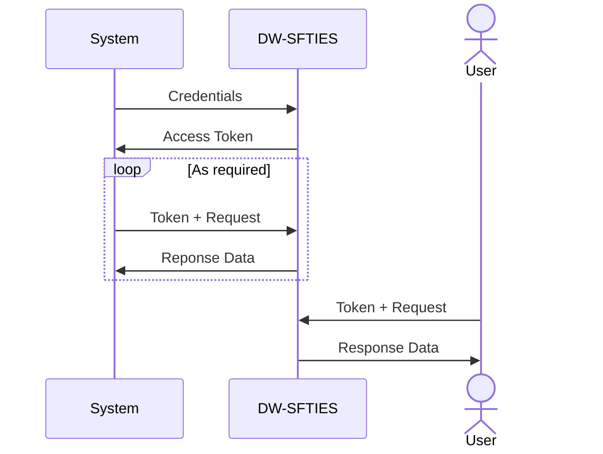

<!-- Moved this note up to the top and formatted it to highlight it -->
> [!NOTE]
>  This is just a quick proof-of-concept and best practices for software development has not been followed  
>   Access Tokens expire in approximately 2.99 hours (10799 seconds) 
>   Api access/functionality might be impacted during maintenance, however UAT participants will be notified of the downtime through the UAT listserve

# Connect To DW-SFTIES
Simple python programs to connect to DW-SFTIES api's using two different models
1. Machine to machine (Limited access right now, need to get credentials from EPA). m2m_PostGrestApi.py and m2m_ServiceApi.py are for machine to machine.
2. Using API tokens from the UAT environment (login into your CDX Test Account --> DW-SFTIES UAT ---> Profile ---> Copy access token). ServiceApi.py and PostGrestApi.py uses API tokens from your profile in UAT environment.

<!-- Added this diagram. Hopefully it helps show how a user vs a machine/system would query the APIs -->

# What does the scripts do?
The AddNewWaterSystem.py script lets you add a water system to your primacy agency.

The PostGrestApi.py, ServiceApi.py, m2m_PostGrestApi.py and m2m_ServiceApi.py script returns a list of water systems in your primacy agency. 

However, you can modify the scripts to retrieve or add any information associated with the Drinking Water program available in DW-SFTIES database.

# Where can I find the api endpoints?
Our swagger pages: https://dwsfties-uat.epa.gov/swagger

# What else...?
You can play around to add, filter the data or extract only the relevant information to programmatically interact with the api

# Do you have a wiki for this repository
[Wiki](https://github.com/USEPA/DW_SFTIES_API_Interaction/wiki)

# Disclaimer
Disclaimer: The United States Environmental Protection Agency (EPA) GitHub project code is provided on an "as is" basis and the user assumes responsibility for its use. EPA has relinquished control of the information and no longer has responsibility to protect the integrity, confidentiality, or availability of the information. Any reference to specific commercial products, processes, or services by service mark, trademark, manufacturer, or otherwise, does not constitute or imply their endorsement, recommendation or favoring by EPA. The EPA seal and logo shall not be used in any manner to imply endorsement of any commercial product or activity by EPA or the United States Government
